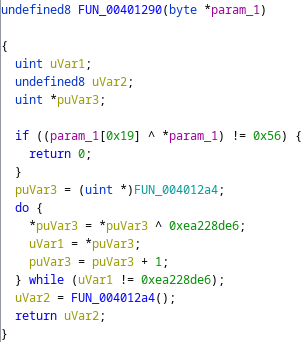
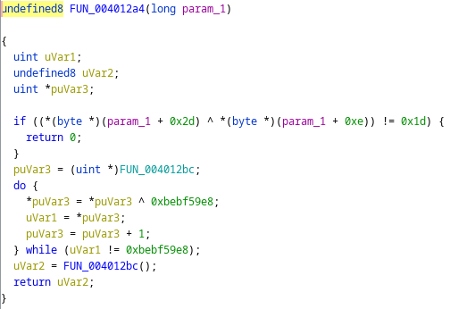

# Rev - Headache (AmateursCTF 2023)

## Problem

A ELF binary is given that has functions obfuscated via XOR in Matryoshka fashion.

## Solution

The solution is mainly broken into 2 parts:
1. Obtain a new condition regarding input check after performing XOR on the relevant parts of the binary
2. Send all conditions into Z3 solver to obtain flag as solution

Regarding the XOR, it is observed that a function will (1) XOR decrypt another fuction and then (2) call it. Each function contains a check for the flag. Examples are shown below.

We start of at 0x401290 with 1 condition about the input `param_1`:



After performing XOR, we obtain a second function at 0x4012a4 which does pretty much the same thing:



This will continue for about 198 more times. Hence, his needs to be automated as it is too painful by hand. The solve script (mainly utilizing capstone engine) is presented as below:

```python
# code XORs this and runs the code
#extracted = bytearray(extracted)
import subprocess
from capstone import *
md = Cs(CS_ARCH_X86, CS_MODE_64)

# Process the binary repeatedly
with open('headache', 'rb') as f:
    data = bytearray(f.read())
function_offset = 0x1290
end_offset = 0x43
with open('headache_processed1', 'w') as f:
    for repeat_num in range(1000):
        print("Trial:", repeat_num, "- write relevant instructions only")
        start, end = function_offset, function_offset
        while data[end] != 0xc3:
            end += 1
        instructions = list(md.disasm(data[start:end + 1], CS_MODE_64 | CS_MODE_LITTLE_ENDIAN))
        function_hasjump = False
        for i, instn in enumerate(instructions):
            if 'rdi' in instn.op_str or 'cmp' in instn.mnemonic:
                f.write("%s|%s\n" %(instn.mnemonic, instn.op_str))
            print("0x%x:\t%s\t%s" %(instn.address, instn.mnemonic, instn.op_str))
            if instn.mnemonic in ['je']:
                function_hasjump = True
                block_start = start + int(instn.op_str[2:], 16) - 8 #8 is a guess that seems to work consistently well?
                block_end = block_start
                test_block_size = 0x100
                block_instructions = list(md.disasm(data[block_start:block_start + test_block_size], CS_MODE_64 | CS_MODE_LITTLE_ENDIAN))
                xor_key = block_instructions[0].op_str.split(', ')[1][2:]
                while len(xor_key) < 8:
                    xor_key = '0' + xor_key
                xor_key = list(bytes.fromhex(xor_key))[::-1]
                function_offset = int(block_instructions[1].op_str.split(', ')[1][3:-1], 16) - 0x400000
                # Attempt to XOR from next function offset till null byte
                pos, cnt = function_offset, 0
                for pos in range(function_offset, 0x4371, 1): # 0x4371 is near end of unknown code block
                    data[pos] ^= xor_key[cnt]
                    pos += 1
                    cnt = (cnt + 1) % 4
                print('XOR-ed', list(map(hex, xor_key)), 'start:', hex(function_offset))
        print('-' * 20)
        if not function_hasjump:
            break

def get_val(l):
    s = l.split(' + ')
    if len(s) <= 1:
        return 'x0'
    index = int(s[1][:-1], 16)
    return f"x{index}"

# Note: flag length is 61 from main
with open('headache_processed1', 'r') as f:
    lines = f.read().split('\n')[:-1]
# Write for Z3 to solve
with open('headache_processed2.py', 'w') as f:
    f.write('from z3 import *\n')
    for i in range(61):
        f.write(f"x{i} = BitVec('x{i}', 8)\n")
    f.write('solve(')
    for i in range(0, len(lines), 3):
        mov_line, xor_line, cmp_line = lines[i], lines[i + 1], lines[i + 2]
        val1 = get_val(mov_line)
        val2 = get_val(xor_line)
        val3 = int(cmp_line.split(', ')[1], 16)
        if i > 0:
            f.write(', ')
        f.write(f"{val1} ^ {val2} == {val3}")
    f.write(')')
p = subprocess.run(['python3 headache_processed2.py'], shell=True, capture_output=True)
result = p.stdout.decode('utf-8')[1:-2].split(',\n ')
result = list(map(lambda x: (int(x[0][1:]), chr(int(x[1]))), map(lambda x: x.split(' = '), result)))
result.sort(key=lambda x: x[0])
# XOR 85 is figured by trial and error on final string
result = list(map(lambda x: chr(ord(x[1]) ^ 85), result))
print(''.join(result))
```

## Flag

amateursCTF{i_h4v3_a_spli77ing_headache_1_r3qu1re_m04r_sl33p}