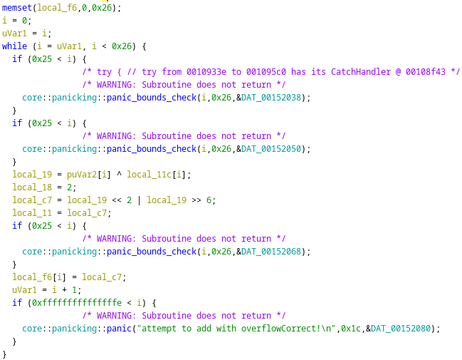
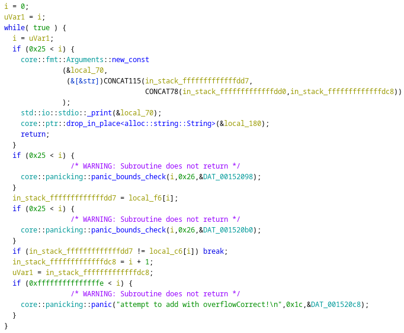

# Rev - Rusteze (AmateursCTF 2023)

## Problem

We are given a binary to reverse. The main logic is below:

Some obfucation login is used to transform each character of the input of length `0x26` with result being stored in `local_f6`:



The obfuscation has 2 main steps:
1. Compute `x[i] = input[i] ^ local_11c[i]`
2. Rotate 2 bits of `x[i]` to obtain `local_f6[i]`

Subsequently, `local_f6` is compared with `local_c6` in an equality check:



## Solution

We simply reverse the obfuscation to obtain the flag:

```python
# local_11c
start = [0x27, 0x97, 0x57, 0xe1, 0xa9, 0x75, 0x66, 0x3e, 0x1b, 99, 0xe3, 0xa0, 5, 0x73, 0x59, 0xfb, 10, 0x43, 0x8f, 0xe0, 0xba, 0xc0, 0x54, 0x99, 6, 0xbf, 0x9f, 0x2f, 0xc4, 0xaa, 0xa6, 0x74, 0x1e, 0xdd, 0x97, 0x22, 0xed, 0xc5]
# local_c6
end = [0x19, 0xeb, 0xd8, 0x56, 0x33, 0, 0x50, 0x35, 0x61, 0xdc, 0x96, 0x6f, 0xb5, 0xd, 0xa4, 0x7a, 0x55, 0xe8, 0xfe, 0x56, 0x97, 0xde, 0x9d, 0xaf, 0xd4, 0x47, 0xaf, 0xc1, 0xc2, 0x6a, 0x5a, 0xac, 0xb1, 0xa2, 0x8a, 0x59, 0x52, 0xe2]
# input len = 38
# Find desired input = end[i] rearranged ^ start[i]
# x = start[i] ^ input[i]
# end[i] = x << 2 | x >> 6
# end[i] >>>>> x[2] x[3] x[4] x[5] x[6] x[7] x[0] x[1]
for i in range(len(end)):
    y = bin(end[i])[2:]
    while len(y) < 8:
        y = '0' + y
    y = list(y)
    x = [None] * 8
    x[2] = y[0]
    x[3] = y[1]
    x[4] = y[2]
    x[5] = y[3]
    x[6] = y[4]
    x[7] = y[5]
    x[0] = y[6]
    x[1] = y[7]
    print(chr(int(''.join(x), 2) ^ start[i]), end='')
print()
```

## Flag

amateursCTF{h0pe_y0u_w3r3nt_t00_ru5ty}

