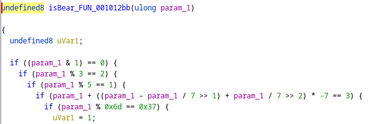
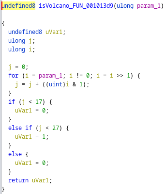
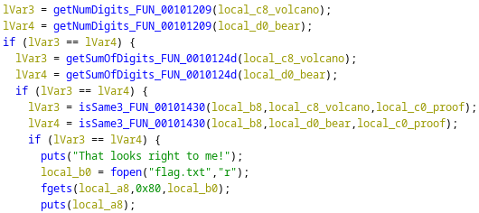

# Rev - Volcano (AmateursCTF 2023)

## Problem

We are given a ELF binary to analyze. In essence, it asks for:
* A "bear" value `B`
* A "volcano" value `V`
* A "proof value `P`

It then checks:
1. If `B` is valid
2. If `V` is valid
3. if `B` and `V` are the "same" based on `P`

## Solution

Step 1 - The check for `B` is as follows:



We notice that there are several conditions for a number to pass the check for being a bear. We can use chinese remainder theorem to obtain a single condition for faster enumeration:

```
Chinese remainder theorem for B:
x = 0 (mod 2)
x = 2 (mod 3)
x = 1 (mod 5)
x = 0x37 (mod 0x6d)
--> x = 2126 (mod 3270)
```

Step 2 - The check for `V` is as follows:



Observe that a value needs to be 18 to 26 bits to be considered a volcano.

Step 3 - The check for `B` being same as `V` via `P` is as follows:



Apart from ensuring that `B` and `V` have the same number of digits, and that the digits add up to the same value, there is a 3rd check as follows:


Notice that if `k = 0`, then `j = 0` as long as 1 bit is the value is greater than 0. By setting `P = 0x1337`, then `k = 0, j = 0` always, nullifying the entire check.

Hence, we simply need to compute a value such that `B = V`, and provide `P = 0x1337` when requested. The solve script is as follows:

```python
from pwn import *

# NOTE: proof = 0x1337
proof = 0x1337
def count_bits(x):
    return len(list(filter(lambda x: x == '1', bin(x)[2:])))

v = 2126
while v < (1 << 28):
    v += 3270
    # Impossible
    if not (v & 1 == 0 and v % 3 == 2 and v % 5 == 1 and v % 0x6d == 0x37):
        continue
    # Valid checks
    if not (v + ((v - v // 7 >> 1) + v // 7 >> 2) * -7 == 3):
        continue
    if not (1 << 18) < v:
        continue
    num_bits = count_bits(v) 
    if 18 <= num_bits and num_bits <= 26:
        print(v, proof)
        break 

# Output:
# 12058616 4919
```

## Flag

Flag obtained via interaction with server:

```
$ nc amt.rs 31010
Give me a bear: 12058616
Give me a volcano: 12058616
Prove to me they are the same: 4919
That looks right to me!
amateursCTF{yep_th0se_l00k_th3_s4me_to_m3!_:clueless:}
```