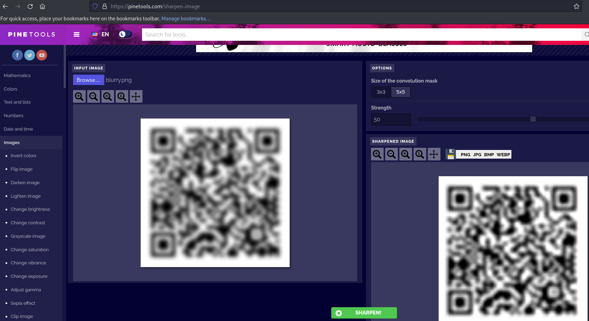

# Forensics - Blurry (Imaginary CTF 2023)

## Problem

Find the value of the following blur QR code (blurry.png):

## Solution

We find any image sharpening tool (e.g. [here](https://pinetools.com/sharpen-image)) and scan the sharpened QR code directly to obtain the flag:

## Flag

ictf{blurR1ng_is_n0_m4tch_4_u_2ab140c2}

