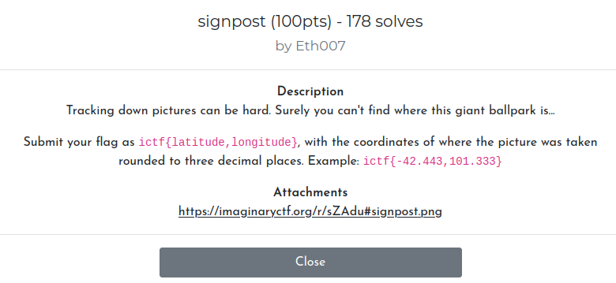
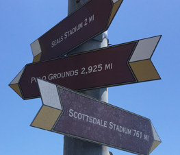
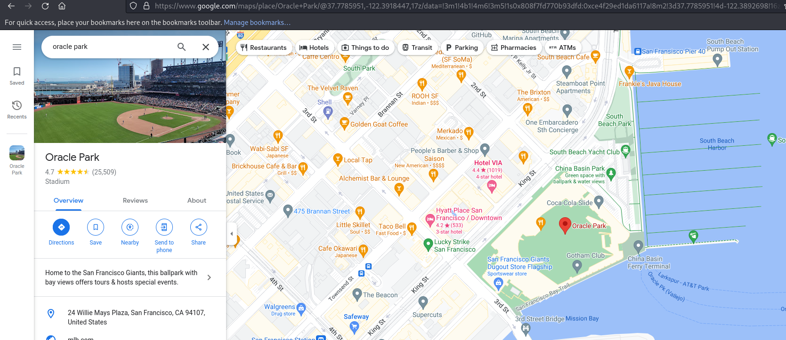

# Misc - Signpost (Imaginary CTF 2023)

## Problem

As below:



Signpost.png:



## Solution

By searching for `Seals Stadium` and + some google image searching / [Wikipedia](https://en.wikipedia.org/wiki/Seals_Stadium), we find that the likely location is in Oracle park:



Due to the size of the park and tediousness of finding the signpost within the park, we bruteforce a limited number of lat-lon values to eventually find the flag (rounded 3 decimal places):

```python
import requests

my_api_key='<HIDDEN>'
url='https://2023.imaginaryctf.org/api/flags/submit?apikey={my_api_key}'
for lon in range(-122393, -122380, 1):
    for lat in range(37776, 37782, 1):
        headers={'Content-Type':'application/json'}
        lat_str = str(lat/1000)
        while len(lat_str.split('.')[1]) < 3:
            lat_str += '0'
        lon_str = str(lon/1000)
        while len(lon_str.split('.')[1]) < 3:
            lon_str += '0'
        json_data = {'flag':'ictf{'+lat_str+','+lon_str+'}'}
        print(json_data)
        r = requests.post(url=url, headers=headers, json=json_data)
        print(r.text, r.status_code)
        if 'incorrect' not in r.text:
            print('DONE')
            exit(0)
```

## Flag

```
{'flag': 'ictf{37.781,-122.389}'}
{"success":false,"error":"Your flag is incorrect"} 200
{'flag': 'ictf{37.776,-122.388}'}
{"success":false,"error":"Your flag is incorrect"} 200
{'flag': 'ictf{37.777,-122.388}'}
{"success":false,"error":"Your flag is incorrect"} 200
{'flag': 'ictf{37.778,-122.388}'}
{"success":true,"challenge":{"id":18,"title":"signpost"}} 200
DONE
```

Flag: `ictf{37.778,-122.388}`
