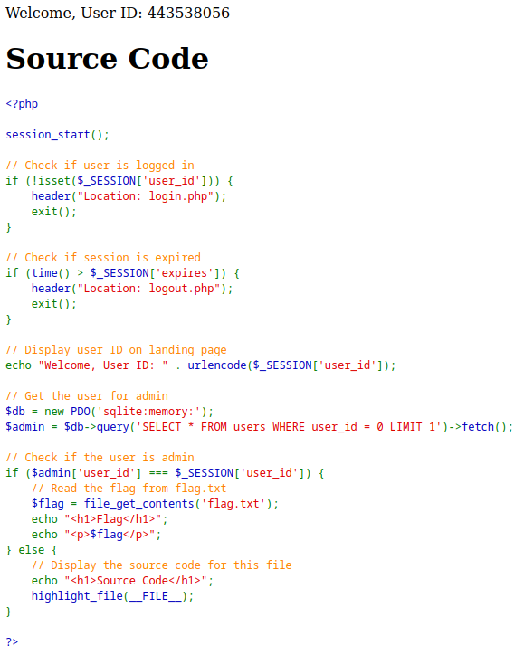
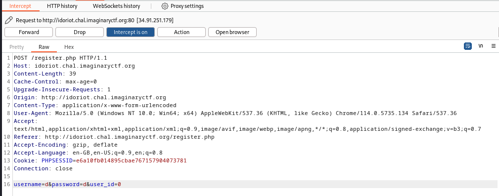
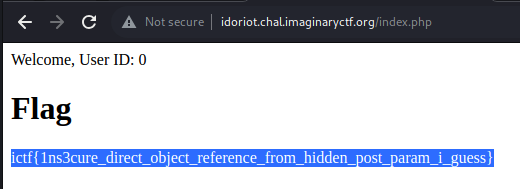

# Web - Idoriot (Imaginary CTF 2023)

## Problem

Obtain flag from web platform.

## Solution

Upon registering as any user, we obtain the following:

Observe that for the flag to display, we need `user_id=0`, which is the user ID of the admin user. When registering, we observe the following:

Since `user_id` can be specified as POST data, we specify `user_id=0` for a new user registration to obtain the flag:

## Flag

ictf{1ns3cure_direct_object_reference_from_hidden_post_param_i_guess}
