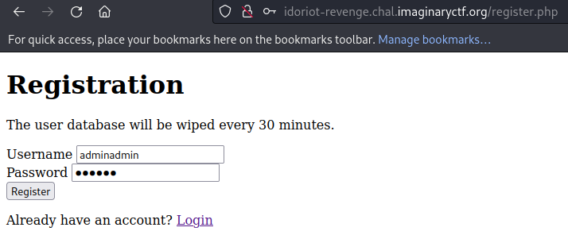
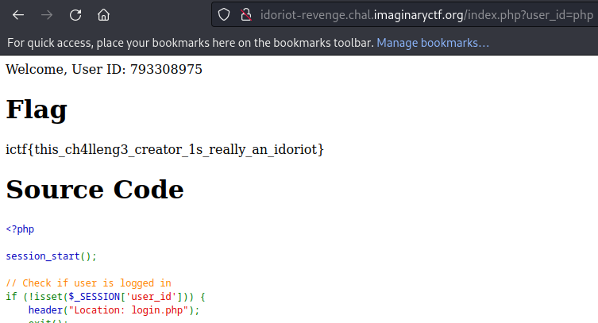

# Web - Idoriot Revenge (Imaginary CTF 2023)

## Problem

After registering for any user, we are presented with the source of the application, e.g.:

```php
# Welcome, User ID: 536123767
# Source Code
<?php

session_start();

// Check if user is logged in
if (!isset($_SESSION['user_id'])) {
    header("Location: login.php");
    exit();
}

// Check if session is expired
if (time() > $_SESSION['expires']) {
    header("Location: logout.php");
    exit();
}

// Display user ID on landing page
echo "Welcome, User ID: " . urlencode($_SESSION['user_id']);

// Get the user for admin
$db = new PDO('sqlite:memory:');
$admin = $db->query('SELECT * FROM users WHERE username = "admin" LIMIT 1')->fetch();

// Check user_id
if (isset($_GET['user_id'])) {
    $user_id = (int) $_GET['user_id'];
    // Check if the user is admin
    if ($user_id == "php" && preg_match("/".$admin['username']."/", $_SESSION['username'])) {
        // Read the flag from flag.txt
        $flag = file_get_contents('/flag.txt');
        echo "<h1>Flag</h1>";
        echo "<p>$flag</p>";
    }
}

// Display the source code for this file
echo "<h1>Source Code</h1>";
highlight_file(__FILE__);
?>
```

## Solution

We observe that 3 checks must succeed for flag to be displayed:
* `user_id` == `'php'`
* Session username must contain the string `admin` via regex match 

Therefore,  we can register a user such as adminadmin/123456:



Then, we set `user_id` GET paramter to `'php'` to obtain flag:



## Flag

ictf{this_ch4lleng3_creator_1s_really_an_idoriot}
