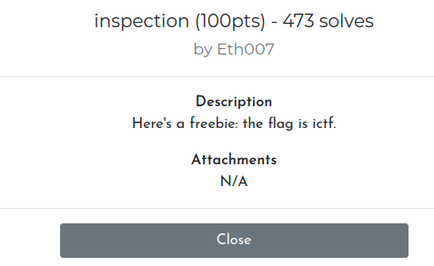
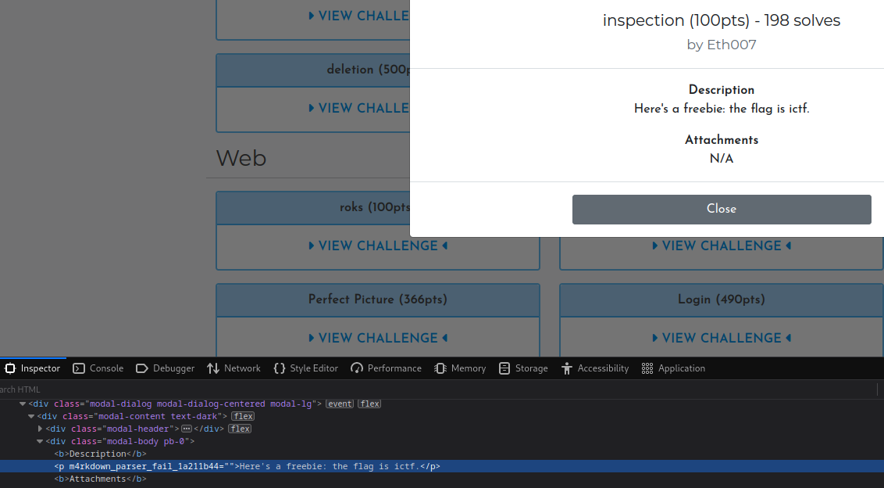

# Web - Inspection (Imaginary CTF 2023)

## Problem

Find the flag. Problem statement is shown below:

## Solution

Right click on ictf and inspect element:

The flag is an attribute of the `
` tag.

## Flag

ictf{m4rkdown_parser_fail_1a211b44}
