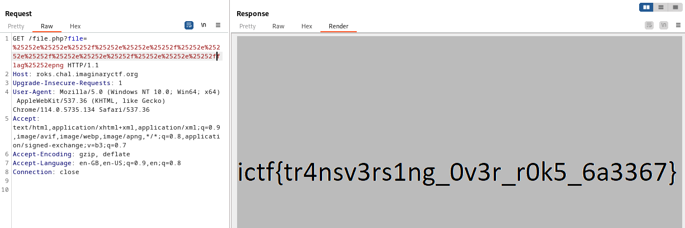

# Web - Roks (Imaginary CTF 2023)

## Problem

We are given index.php and file.php:

```php
// index.php
<!DOCTYPE html>
<html>
<head>
    <title>rok gallery</title> </style>
    <link rel="stylesheet" type="text/css" href="styles.css"> 
</head>
<body>
    <h1>rok gallery</h1>
    
    <br><br>
    <button onclick="requestRandomImage()">get rok picture</button>
    <script>
        function requestRandomImage() {
	    var imageList = ["image1", "image2", "image3", "image4", "image5", "image6", "image7", "image8", "image9", "image10"]

            var randomIndex = Math.floor(Math.random() * imageList.length);
            var randomImageName = imageList[randomIndex];

            var xhr = new XMLHttpRequest();
            xhr.onreadystatechange = function () {
                if (xhr.readyState === 4 && xhr.status === 200) {
                    var blob = xhr.response;
                    var imageUrl = URL.createObjectURL(blob);
                    document.getElementById("randomImage").src = imageUrl;
                }
            };

            xhr.open("GET", "file.php?file=" + randomImageName, true);
            xhr.responseType = "blob";
            xhr.send();
        }
    </script>
</body>
</html>
```

```php
// file.php
<?php
  $filename = urldecode($_GET["file"]);
  if (str_contains($filename, "/") or str_contains($filename, ".")) {
    $contentType = mime_content_type("stopHacking.png");
    header("Content-type: $contentType");
    readfile("stopHacking.png");
  } else {
    $filePath = "images/" . urldecode($filename);
    $contentType = mime_content_type($filePath);
    header("Content-type: $contentType");
    readfile($filePath);
  }
?>
```

We find that in file.php, after performing URL decode, there is a check to see if '.' or '/' exists. If so, an image "stopHacking.png" is displayed.

## Solution

The code above points us to using directory traversal. From the Dockerfile, we observe the flag is at `/flag.png`:

```docker
FROM php:8-apache

RUN /usr/sbin/useradd -u 1000 user

COPY index.php /var/www/html/
COPY file.php /var/www/html/
COPY styles.css /var/www/html/
COPY stopHacking.png /var/www/html/

RUN mkdir /var/www/html/images
COPY images/* /var/www/html/images
COPY flag.png /

VOLUME /var/log/apache2
VOLUME /var/run/apache2

CMD bash -c 'source /etc/apache2/envvars && APACHE_RUN_USER=user APACHE_RUN_GROUP=user /usr/sbin/apache2 -D FOREGROUND'

```

Given that there is a URL decode present when processing the file path for directory traversal, we find that eventually performing 'triple' URL encoding to make it work (`'.' = %25252e, '/' = %25252f`):



## Flag

ictf{tr4nsv3rs1ng_0v3r_r0k5_6a3367}