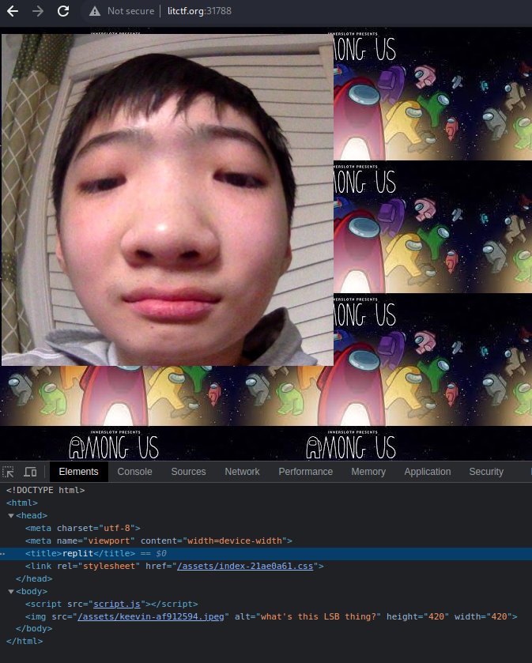
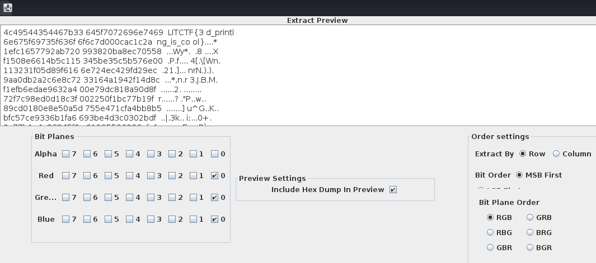

# Misc - kevin (LITCTF 2023)

## Problem

We are told this is a steganography problem. We find the following image of Kevin(?) on the website link given:

## Solution

Since it is steganography on JPEG with `what's this LSB thing?` as it a hint, we use stegsolve and find the flag by checking the LSB for the RGB channels:

## Flag

LITCTF{3d_printing_is_cool}