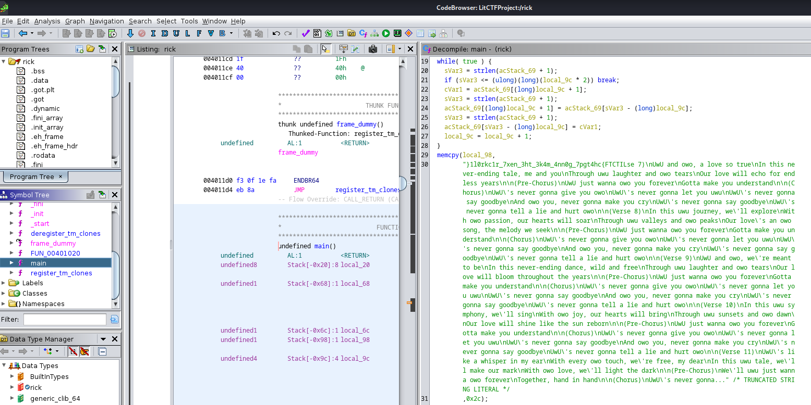

# Rev - Rick (LITCTF 2023)

## Problem

We are given a binary named `rick` to perform reverse engineering on.

## Solution

Analyzing the binary in Ghidra reveals the presence of the reverse flag:



The flag is therefore found as follows:

```python
print('}1l0rkc1r_7xen_3ht_3k4m_4nn0g_7pgt4hc{FTCTIL'[::-1])
# LITCTF{ch4tgp7_g0nn4_m4k3_th3_nex7_r1ckr0l1}
```

## Flag

LITCTF{ch4tgp7_g0nn4_m4k3_th3_nex7_r1ckr0l1}

