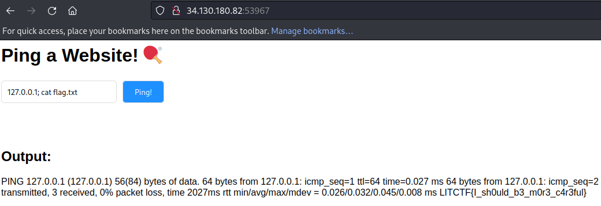

# Web - Ping Pong (LITCTF 2023)

## Problem

We are given the following `app.py` file:

```python
from flask import Flask, render_template, redirect, request
import os

app = Flask(__name__)

@app.route('/', methods = ['GET','POST'])
def index():
    output = None
    if request.method == 'POST':
        hostname = request.form['hostname']
        cmd = "ping -c 3 " + hostname
        output = os.popen(cmd).read()

    return render_template('index.html', output=output)

```

## Solution

This is a classic command injection issue, where we can append additional commands behind ping to execute what we want. We use the payload `127.0.0.1; cat flag.txt` to obtain the flag:



## Flag

LITCTF{I_sh0uld_b3_m0r3_c4r3ful}
