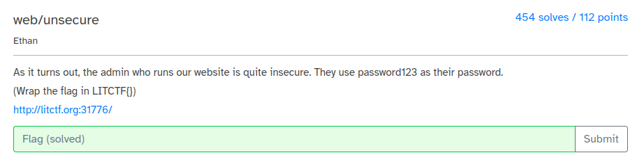
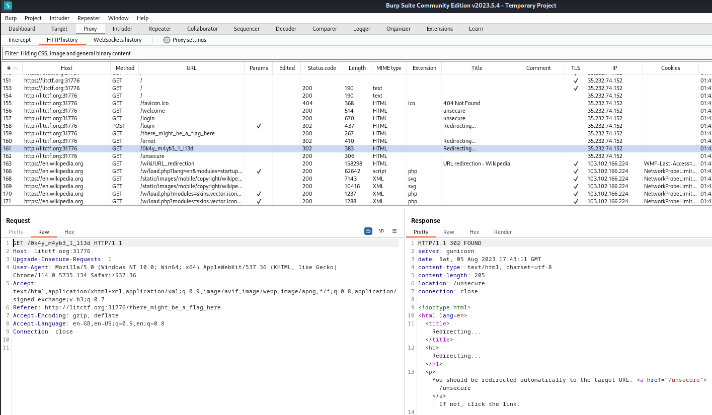

# Web - Unsecure (LITCTF 2023)

## Problem

The problem statement provides the credentials for login to a website (username: admin, password: password123)

## Solution

Upon login, we find that there are several redirects:
* /there_might_be_a_flag_here
* /ornot
* /0k4y_m4yb3_1_l13d
* Wikipedia's article on URL redirection

We find that the flag is simply the value of 1 of these endpoints (`0k4y_m4yb3_1_l13d`).

## Flag

LITCTF{0k4y_m4yb3_1_l13d}
