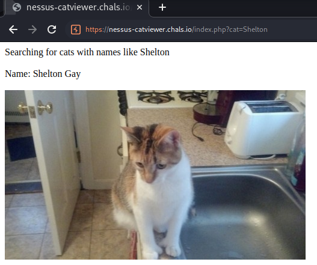
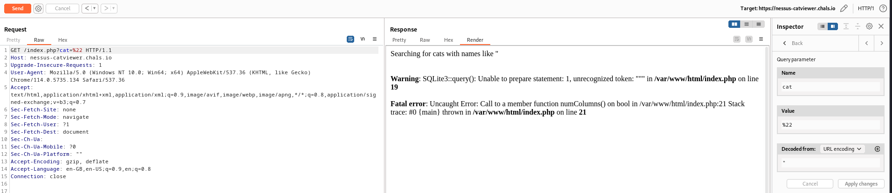
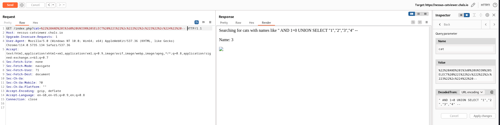
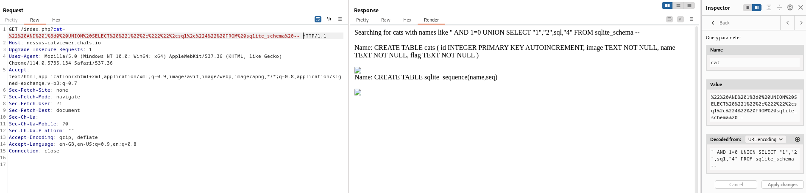
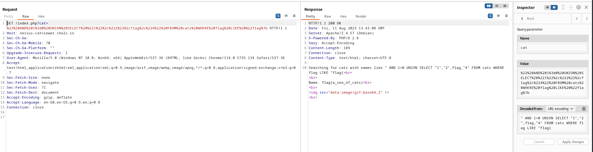

# Web - Cat Viewer (Tenable CTF 2023)

## Problem

We are given a platform for viewing cats, for example:



## Solution

Notice that `cat=Shelton` is in the GET request parameters. Changing it to `"` gives an error, indicating potential SQL injection:



There are restrictions if we were to select too many cats (in terms of response size). Hence, the following union-based SQL injection requires something like `AND 1=0` for the query for cats to work well:



We are aware that the 3rd field is printed. We also note the schema for the cats table in SQLite 3:



Hence, we can use the following payload to finally print the challenge flag:

```
" AND 1=0 UNION SELECT "1","2",flag,"4" FROM cats WHERE flag LIKE "flag{
```



## Flag

flag{a_sea_of_cats}